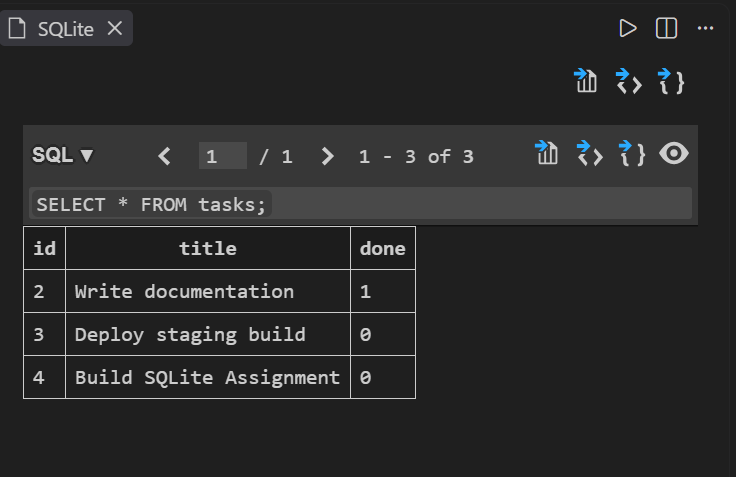

# To-Do CRUD API

An in-memory RESTful API built with FastAPI demonstrating foundational CRUD operations, status code rigor, request validation, and OpenAPI/Swagger documentation.

## Running Locally

```bash
# 1. Clone & setup virtual environment
git clone [https://github.com/](https://github.com/)<your-username>/todo-crud-api.git
cd todo-crud-api
python -m venv venv
source venv/bin/activate  # Windows: venv\Scripts\activate

# 2. Install dependencies
pip install -r requirements.txt

# 3. Start server
uvicorn main:app --reload --port 8000

## Database Architecture (W3 · A1)

### Why SQLite?
SQLite is a zero-configuration, serverless, single-file database engine. Replacing runtime memory arrays with `tasks.db` provides data persistence across process lifecycles and server restarts without the overhead of running a dedicated database service.

- **Database File:** `./tasks.db` (auto-initialized on startup)
- **Table Schema:** `tasks` (`id` INTEGER PRIMARY KEY AUTOINCREMENT, `title` TEXT NOT NULL, `done` BOOLEAN NOT NULL DEFAULT 0)

### Database Exploration


Sample SQL query executed:
```sql
SELECT * FROM tasks;